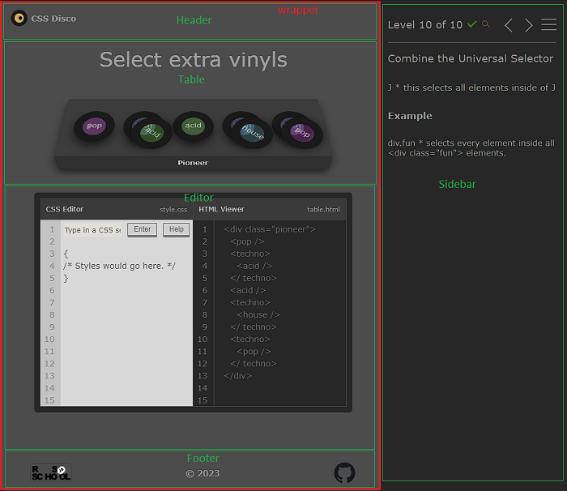
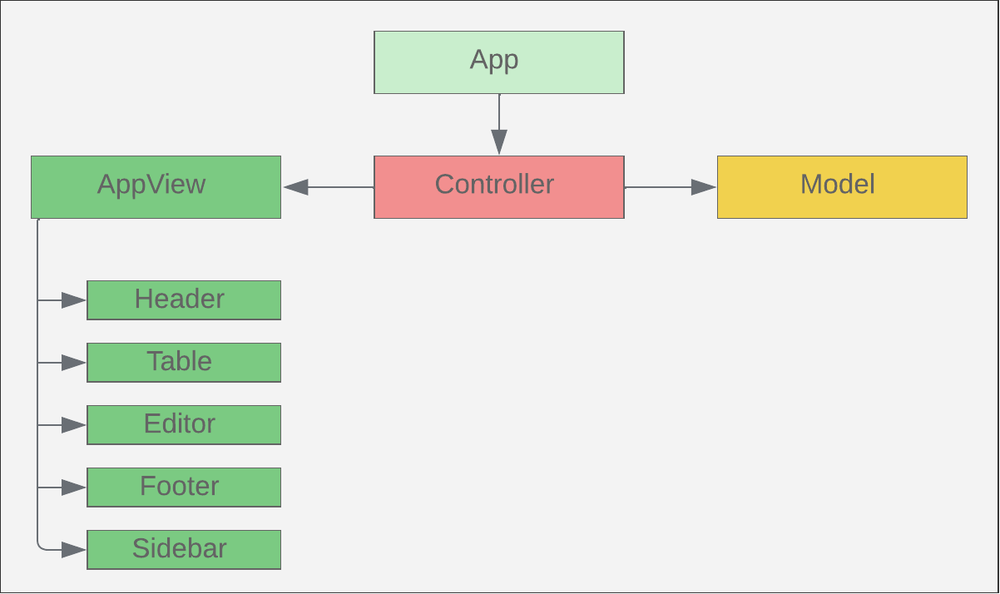
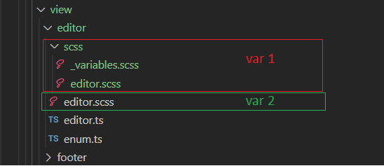
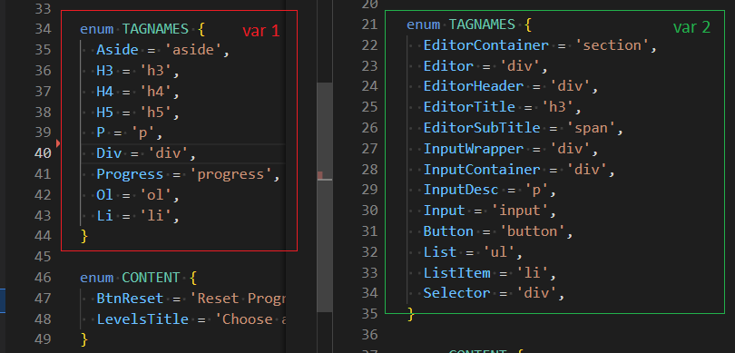
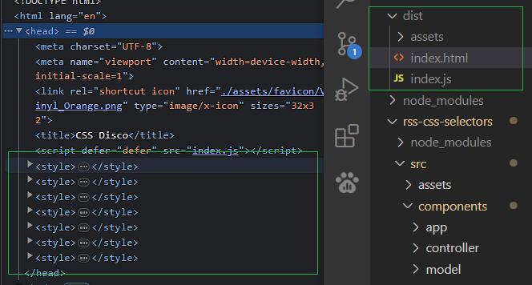

## CSS Selectors

1. Task: [link](https://github.com/rolling-scopes-school/tasks/blob/master/tasks/rs-css.md)
2. Deploy: [link](https://rolling-scopes-school.github.io/geominerr-JSFE2023Q1/rss-css-selectors/)

---

#### Stack:

   - HTML
   - SASS/SCSS
   - TS

#### Linter:

   - ESLint [ airbnb-typescript/base, plugin:@typescript-eslint/recommended, plugin:prettier/recommended]

#### Formatter:

   - Prettier

#### Build:

   - WebPack

#### Test:

   - Jest

---

### Components

### Class diagram

Выше структура моего приложения, использовал паттерн MVC.
   - **Model**:
     - модель хранит в себе уровни, состояние приложения.
     - при запуске устанавливает стартовое состояние в зависимомсти от localStorage
     - по запросу от controller предоставляет данные текущего уровень, записывает текущий уровень, сохраняет состояние в LS
     - проводит проверку количества выполненых уровней
   - **Controller**:
     - после старта -> запрос в Model за уровнем и отправка данных в AppView для рендера страницы, после рендера получает и сохранят в props елементы с которым взаимодействует пользователь
     - добавляет обработчик событий на все элементы, при взаимодествие с которыми необходимо взаимодействие с Model
     - делает запросы к AppView на обновление элементов
   - **AppView**:
     - рендер страницы
     - после рендера отправляет все элементы с которыми взаимодействует пользователь
     - обновляет элементы или контент на страницы
     - в дочерних компонентах добавляется обработчик событий на элементы, которые используются для визуала, но не требует взаимодествия с моделью.

- ❓ Сооветствует ли моя реализация паттерну?
- ❓ В контексте данного таска , что относится к бизнес логике ?
- ❓ В методах Controller при обработке событий добавляя / удаляю стили к интерактивным элементам. Возможно необходимо это полностью реализовывать во View ?
- ❓ Должен ли Controller хранить элементы View ?

---

1. ### HTML/СSS

- При верстки на flex :
  -- wrapper {flex-grow: 1}
  -- sidebar {width: 30rem}
  -- В девтулзах в "Responsive Mode" верстка почему-то разваливалась! В обычном режиме все красиво..., может баг, а може чего-то не понимаю.

  - ❓ Исправлял через position: fixed , насколько критично использовать fixed (поддержка всеми браузерами есть, только c firefox вроде немного потанцевать надо) ?

2. ### CSS

- На одном из проектов использовал упрощеную архитектуру 7-1

  - ❓ в этом таске в каждом компоненте лежит свой .scss . Как лучше: отдельно директория scss/ со всей структорой [base, variables, layout, components...] и от туда импортить в компноненты, или в каждом компонентне на одном уровне лежит componentName.scss ?

- Если все стили остаются в одной директории с компонентом:

  - ❓ сss переменные просто прописывать в началае файла componentName.scss или создавать \_variables.scss и импортить их в componentName.scss (в таком случае и директория отдельная scss/ должна быть в компоненте)?
        

3. ### TS

- enums
- 

  - ❓ Как лучше и неизбыточно ли это ?

- группировка методов класса:

  - ❓ сначала public, после private. Группировать их как то необходимо(по логике или последовательности выполенения/использования) ?

- types/

  - ❓ для каждого модуля/компонента отдельный componentName.\[type].ts или один general.\[type].ts на весь проект ?

4. ### WebPack/СSS

- при сборке:
- 
  - ❓ Такой вариант **ОК** или лучше использовать **mini-css-extract-plugin** собирать все в main.css и подключать в html через link ?

5. ### General:

- ❓ сколько времени необходимо для реализации такого приложения (понимаю что в реальной разработке никто не пишет на нативном JS, фреймворки ускоряют разработку, но все же как-бы ты оценивила такую аппку (метрика: время, шкала: bad - X hours, normal - X hours, good - X hour\[s]!? :-\) ) ?

